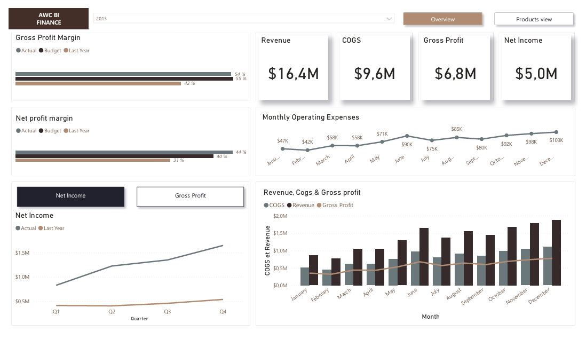

## 🚲 Adventure Works Cycles Financial Reporting Project
Welcome to the Adventure Works Cycles Financial Reporting Project! This repository showcases my skills in data analysis, SQL, and Power BI by creating an insightful Profitability Analysis Report for Adventure Works Cycles.

## 📊 Project Overview
Adventure Works Cycles, a leading manufacturer and retailer of bicycles and related accessories, aims to leverage data-driven insights to improve financial decision-making and operational efficiency. This project focuses on analyzing the company's profitability across different product lines.

## 🛠️ Project Scope and Objectives
### Report Objective
Profitability Analysis: Provide insights into the company's profitability across different product lines.

### Key Performance Indicators (KPIs)
- Gross Profit Margin: (Total Revenue - Cost of Goods Sold) / Total Revenue
- Net Profit Margin: Net Income / Total Revenue

### Data Requirements
We will use data from the AdventureWorks SQL Serveur database, specifically:

- Sales data -> FactSales
- Date -> DimDate
- Entity -> DimSalesTerritory
- Product -> DimProduct, DimProductCategory, DimProductSubCategorie

The report must be focused on 2 years (2012 & 2013).

### Reporting Requirements
Profitability Analysis Report:
- Overview: A high-level view showing overall gross profit margin and net profit margin.
- Detailed Breakdown: Profit margins for different product lines.
- Interactive Visuals: Allow filtering by product category and time period.

### Other specifications
- Users want to be able to compare the main KPI's over Last Year and Target
- Data will be updated every year.
- The report must be optimized for quick responses and an overall great user experience.

## 🗂️ Repository Structure
- Data/: Contains all raw data files.
- Report/: Includes the Power BI report file and related documentation.
- Queries & DAX/: SQL/DAX scripts for data integration and Calculations.

## ✨ Skills Demonstrated
- Data Analysis: Leveraged SQL to extract and preprocess data for financial analysis.
- Business Intelligence: Developed a comprehensive Profitability Analysis Report in Power BI.
- Data Visualization: Created interactive visuals and dashboards to present financial insights effectively.
- Problem Solving: Identified key performance indicators and devised methods to calculate them accurately.

## 🤝 Contributing
This project is part of my portfolio and is not open for contributions. However, feedback is always welcome!

## 📞 Contact
For any questions or feedback, please contact:

Jivaldo JULIEN - jivaldo.julien@gmail.com

Thank you for viewing my Adventure Works Cycles Financial Reporting Project! This project demonstrates my ability to leverage data analysis and business intelligence tools to drive actionable insights and informed decision-making
